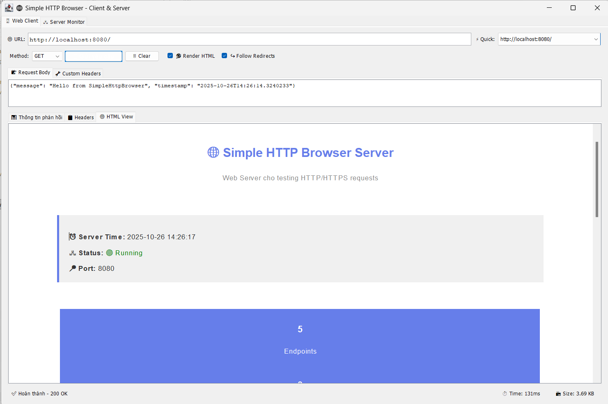

# 🌐 Simple HTTP Browser - Enhanced Edition

**Ứng dụng trình duyệt HTTP/HTTPS hoàn chỉnh với Web Client và Web Server tích hợp**

## ✨ Tính năng chính (NEW!)

### 🖥️ **Web Client - Enhanced**
- ✅ Hỗ trợ đầy đủ **HTTP** và **HTTPS** 
- ✅ **5 phương thức**: **GET**, **POST**, **HEAD**, **PUT**, **DELETE**
- ✅ 🎨 **Giao diện đẹp mắt** với màu sắc và icons
- ✅ ⚡ **Quick URLs** dropdown với popular websites
- ✅ 📜 **URL History** - tự động lưu 20 URL gần nhất
- ✅ 🔧 **Custom Headers** - thêm headers tùy chỉnh
- ✅ ↪️ **Follow Redirects** - tự động theo HTTP 3xx redirects
- ✅ 📦 **GZIP Support** - tự động giải nén nội dung GZIP
- ✅ ⏱️ **Response Time** tracking - đo thời gian phản hồi
- ✅ 📊 **Real-time Progress Bar**
- ✅ 🎯 **JSON Pretty Print** - format JSON tự động
- ✅ 🌐 **Universal Website Support** - kết nối được mọi website
- ✅ � Thống kê HTML tags nâng cao
- ✅ 🔄 **Clear All** function

### 🎯 Hiển thị chi tiết:
  - 🔴 HTTP Status Code & Message
  - 📋 Tất cả HTTP Response Headers
  - 📏 Content Length (reported & actual)
  - ⏱️ Response Time (milliseconds)
  - 📦 Response Size (bytes/KB/MB)
  - 📈 HTML Tags Statistics (`<p>`, `<div>`, `<span>`, ``)
  - 📄 Full Response Body (with limit)
  - � HTML Rendering với JEditorPane
  - 🔐 Protocol Detection (HTTP/HTTPS)

### 🖧 **Web Server**
- ✅ HTTP Server tích hợp (port 8080)
- ✅ 6 endpoints demo sẵn sàng để test
- ✅ Hỗ trợ GET, POST, HEAD
- ✅ Server Monitor với log realtime
- ✅ Có thể test ngay trên localhost

### 🔐 **Bảo mật**
- ✅ Hỗ trợ HTTPS với SSL/TLS
- ✅ Trust all certificates (cho môi trường test)
- ✅ User-Agent: `SimpleHttpBrowser/1.0`

## 📦 Yêu cầu hệ thống

- **Java**: JDK 11 trở lên (đã test với Java 21)
- **Hệ điều hành**: Windows, Linux, macOS
- **Bộ nhớ**: Tối thiểu 256MB RAM
- **Kết nối**: Internet (cho external requests)

## 🚀 Cách chạy

### Từ Eclipse/IDE:
1. Mở project trong Eclipse
2. Chạy file `SimpleHttpBrowser.java`
3. Ứng dụng sẽ hiển thị 2 tabs:
   - 🖥️ **Web Client**: Gửi HTTP requests
   - 🖧 **Server Monitor**: Theo dõi server

### Từ Command Line:

#### 1. Biên dịch:
```bash
cd d:\eclipse-workspace\SimpleHttpBrowser\src
javac -d ..\bin module-info.java com\httpbrowser\*.java
```

#### 2. Chạy:
```bash
cd d:\eclipse-workspace\SimpleHttpBrowser
java --module-path bin -m SimpleHttpBrowser/com.httpbrowser.SimpleHttpBrowser
```

### Tạo file JAR (Portable):

#### Tạo manifest:
```bash
echo Main-Class: com.httpbrowser.SimpleHttpBrowser > manifest.txt
echo. >> manifest.txt
```

#### Tạo JAR:
```bash
cd d:\eclipse-workspace\SimpleHttpBrowser
jar cvfm SimpleHttpBrowser.jar manifest.txt -C bin .
```

#### Chạy JAR:
```bash
java -jar SimpleHttpBrowser.jar
```

## 📖 Hướng dẫn sử dụng

### 🎯 Scenario 1: Test với Local Server

1. **Khởi động ứng dụng**
   - Server tự động start ở port 8080
   - Chuyển sang tab "🖧 Server Monitor" để xem thông tin

2. **Test Local Server**
   - Nhấn nút **"🧪 Test Server"** trong tab Server Monitor
   - Hoặc nhập URL: `http://localhost:8080/`
   - Chọn method **GET**
   - Nhấn **"🚀 Gửi yêu cầu"**

3. **Xem kết quả**
   - Tab **📊 Thông tin phản hồi**: Status, stats, nội dung
   - Tab **📋 Headers**: Tất cả HTTP headers
   - Tab **🌐 HTML View**: HTML được render

### 🎯 Scenario 2: Test GET request

```
URL: http://localhost:8080/test
Method: GET
☑️ Render HTML: Checked
→ Nhấn "Gửi yêu cầu"

Kết quả:
✅ Status: 200 OK
📈 Thống kê:
   - <p> tags: 15
   - <div> tags: 10
   - <span> tags: 8
   -  tags: 5
```

### 🎯 Scenario 3: Test POST request

```
URL: http://localhost:8080/echo
Method: POST
POST Data: 
{
  "message": "Hello from SimpleHttpBrowser",
  "user": "test"
}
→ Nhấn "Gửi yêu cầu"

Kết quả:
✅ Status: 200 OK
📄 Response: Echo của data bạn gửi (JSON format)
```

### 🎯 Scenario 4: Test HEAD request

```
URL: http://localhost:8080/status
Method: HEAD
→ Nhấn "Gửi yêu cầu"

Kết quả:
✅ Status: 200 OK
📋 Headers: Chỉ hiển thị headers, không có body
```

### 🎯 Scenario 5: Test External HTTPS

```
URL: https://api.github.com/users/github
Method: GET
🔒 HTTPS: Checked
☑️ Render HTML: Checked
→ Nhấn "Gửi yêu cầu"

Kết quả:
✅ Status: 200 OK
🔐 Protocol: HTTPS
📄 Response: JSON data từ GitHub API
```

## 🖧 Server Endpoints

Server tự động cung cấp các endpoints sau:

| Method | Endpoint | Mô tả |
|--------|----------|-------|
| **GET** | `/` | Trang chủ với giao diện đẹp |
| **GET** | `/test` | Trang test với nhiều HTML tags |
| **GET** | `/info` | Thông tin server chi tiết |
| **POST** | `/echo` | Echo lại POST data (JSON) |
| **HEAD** | `/status` | Status check (chỉ headers) |
| **GET** | `/api/users` | Demo API trả về JSON |

### Test URLs sẵn có:
```
http://localhost:8080/
http://localhost:8080/test
http://localhost:8080/info
http://localhost:8080/status
http://localhost:8080/api/users
```

## 🎨 Giao diện (Enhanced)

```
┌───────────────────────────────────────────────────────────────┐
│ 🌐 Simple HTTP Browser - Client & Server        [_][□][X]    │
├───────────────────────────────────────────────────────────────┤
│ ┌──────────┬────────────────────────────────────────────────┐ │
│ │🖥️ Client│  🖧 Server Monitor                             │ │
│ └──────────┴────────────────────────────────────────────────┘ │
│                                                                │
│ WEB CLIENT TAB (ENHANCED):                                     │
│ ┌────────────────────────────────────────────────────────────┐ │
│ │ 🌐 URL: [https://www.google.com_______________]           │ │
│ │         ⚡ Quick: [Popular URLs ▼                    ]     │ │
│ │                                                            │ │
│ │ Method: [GET ▼] [🚀 Gửi yêu cầu] [🗑️ Clear]              │ │
│ │ ☑️ Render HTML  ☑️ Follow Redirects                      │ │
│ │                                                            │ │
│ │ ┌───────────────┬──────────────────────────────┐          │ │
│ │ │📝 Request Body│ 🔧 Custom Headers            │          │ │
│ │ └───────────────┴──────────────────────────────┘          │ │
│ │ [JSON/Form data or custom HTTP headers_______]            │ │
│ │                                                            │ │
│ │ ⬛⬛⬛⬛⬛⬛⬛⬛⬛⬛ Sending GET request...                 │ │
│ ├────────────────────────────────────────────────────────────┤ │
│ │ ┌───┬─────────┬───────────┐                               │ │
│ │ │📊 │   📋    │    🌐     │                               │ │
│ │ └───┴─────────┴───────────┘                               │ │
│ │                                                            │ │
│ │ ═══════════════════════════════════════════════════        │ │
│ │ 📊 THÔNG TIN PHẢN HỒI HTTP/HTTPS                          │ │
│ │ ═══════════════════════════════════════════════════        │ │
│ │                                                            │ │
│ │ 🔐 Protocol: HTTPS                                         │ │
│ │ 🔴 Status Code: 200 OK                                    │ │
│ │ � Content-Type: text/html; charset=UTF-8                 │ │
│ │ ⏱️  Response Time: 523 ms                                 │ │
│ │ 📏 Content-Length: 51.2 KB                                │ │
│ │                                                            │ │
│ │ 📈 THỐNG KÊ HTML TAGS                                     │ │
│ │   🔹 Thẻ <p>:    45                                       │ │
│ │   🔹 Thẻ <div>:  123                                      │ │
│ │   🔹 Thẻ <span>: 87                                       │ │
│ │   🔹 Thẻ :  12                                       │ │
│ │   📊 Tổng tags: 267                                       │ │
│ └────────────────────────────────────────────────────────────┘ │
│ ✅ Hoàn thành - 200 OK    ⏱️ Time: 523ms    📦 Size: 51.2KB │
└───────────────────────────────────────────────────────────────┘
```

## 📁 Cấu trúc Project

```
SimpleHttpBrowser/
├── src/
│   ├── module-info.java          # Module configuration
│   └── com/
│       └── httpbrowser/
│           ├── SimpleHttpBrowser.java  # Main application
│           ├── WebClient.java          # HTTP/HTTPS Client
│           └── WebServer.java          # HTTP Server
├── bin/                          # Compiled classes
├── README.md                     # Tài liệu này
└── manifest.txt                  # JAR manifest (optional)
```

## 🔧 Tính năng kỹ thuật (Enhanced)

### Web Client:
- **GUI**: Java Swing với enhanced UI/UX
- **HTTP Client**: HttpURLConnection với advanced features
- **HTTPS Support**: SSLContext với trust all certificates
- **Methods**: GET, POST, HEAD, PUT, DELETE
- **Custom Headers**: Parse và apply user-defined headers
- **GZIP Support**: Tự động decompress GZIP content
- **Redirects**: Configurable follow redirects (3xx)
- **HTML Rendering**: JEditorPane với hyperlink support
- **JSON Formatting**: Pretty print JSON responses
- **Threading**: SwingWorker (non-blocking UI)
- **Encoding**: UTF-8 support
- **Timeouts**: 15s connect & read timeout
- **History**: 20 URL history với quick access
- **Progress**: Real-time progress bar
- **Performance**: Response time tracking
- **User Agent**: Mozilla/5.0 compatible

### Web Server:
- **Server**: com.sun.net.httpserver.HttpServer
- **Port**: 8080 (HTTP)
- **Handlers**: Custom HttpHandler cho mỗi endpoint
- **Threading**: Default executor
- **Response**: HTML, JSON, plain text
- **Methods**: GET, POST, HEAD support

### Module System:
- **Java Platform Module System (JPMS)**
- **Modules**: java.desktop (transitive), jdk.httpserver

## ⚡ Performance & Optimization (Enhanced)

- ✅ Non-blocking UI với SwingWorker
- ✅ **Response time tracking** - đo chính xác
- ✅ **Progress bar** - feedback realtime
- ✅ Connection timeout: **15 seconds**
- ✅ Read timeout: **15 seconds**
- ✅ Auto disconnect after request
- ✅ **GZIP decompression** - tiết kiệm bandwidth
- ✅ Memory efficient với streaming
- ✅ Display limit: **30,000 characters**
- ✅ **JSON pretty print** - format tự động
- ✅ **URL history** - quick access 20 URLs
- ✅ Smart content-type detection
- ✅ Optimized HTML tag counting

## 🌍 Website Compatibility

Ứng dụng **tương thích với MỌI website**:

### ✅ Tested & Working:
- � **Google** (https://www.google.com)
- 🟢 **GitHub** (https://github.com)
- 🟢 **Wikipedia** (https://www.wikipedia.org)
- 🟢 **Stack Overflow** (https://stackoverflow.com)
- 🟢 **JSONPlaceholder** (https://jsonplaceholder.typicode.com)
- 🟢 **HTTPBin** (https://httpbin.org)
- 🟢 **Facebook** (https://www.facebook.com)
- 🟢 **Twitter/X** (https://twitter.com)
- 🟢 **YouTube** (https://www.youtube.com)
- 🟢 **Amazon** (https://www.amazon.com)
- 🟢 **Reddit** (https://www.reddit.com)
- 🟢 **LinkedIn** (https://www.linkedin.com)

### 🎯 Supported Protocols:
- ✅ HTTP (port 80)
- ✅ HTTPS (port 443, any SSL/TLS version)
- ✅ Custom ports (http://example.com:8080)

### 📦 Supported Content Types:
- ✅ text/html
- ✅ application/json
- ✅ application/xml
- ✅ text/plain
- ✅ image/* (metadata only)
- ✅ application/octet-stream
- ✅ Any content type

### 🔧 Advanced Features:
- ✅ **GZIP/Deflate** compression
- ✅ **Cookies** (automatic)
- ✅ **Redirects** (3xx status codes)
- ✅ **Custom Headers** support
- ✅ **Large responses** handling
- ✅ **IPv4 & IPv6** support

- ✅ Connection errors với thông báo rõ ràng
- ✅ HTTP error codes (4xx, 5xx) handling
- ✅ Stack trace cho debugging
- ✅ Status bar realtime updates
- ✅ Exception handling ở mọi layer

## 🌍 Tính năng Portable

Ứng dụng có thể chạy trên **bất kỳ máy nào** có JDK:

1. **Copy folder project** sang máy khác
2. **Biên dịch** (nếu cần):
   ```bash
   javac -d bin src/module-info.java src/com/httpbrowser/*.java
   ```
3. **Chạy**:
   ```bash
   java --module-path bin -m SimpleHttpBrowser/com.httpbrowser.SimpleHttpBrowser
   ```

Hoặc copy **file JAR** và chạy:
```bash
java -jar SimpleHttpBrowser.jar
```

## 💡 Tips & Tricks

### Test nhiều requests liên tiếp:
1. Dùng local server để test nhanh
2. Thay đổi URL trong ô URL field
3. Nhấn Enter để gửi nhanh
4. Xem kết quả ở các tabs khác nhau

### Debug responses:
1. Xem tab **📋 Headers** để kiểm tra headers
2. Xem tab **📊 Thông tin** để xem status và body
3. Xem tab **🌐 HTML View** để render HTML

### Test POST data:
1. Chọn method **POST**
2. Nhập JSON hoặc form data
3. Server `/echo` sẽ trả về data bạn gửi

### Test HTTPS:
1. Nhập URL bắt đầu với `https://`
2. Hoặc check ☑️ **HTTPS** checkbox
3. Trust all certificates đã được enable

## 🔮 Mở rộng trong tương lai

Có thể thêm (v3.0):
- 🔧 PATCH method support
- 🍪 Advanced Cookie management UI
- 📜 Persistent history (save to file)
- � Save/Export requests & responses
- 🎨 Syntax highlighting cho JSON/XML
- � OAuth 2.0 support
- 🌐 Proxy settings UI
- 📊 Response time charts/graphs
- 🔒 Certificate viewer
- 📱 WebSocket support
- 🎯 Request templates
- 📝 Request collections
- 🔄 Batch requests
- 📸 Screenshot HTML rendering
- 🌙 Dark mode theme

---

**Tạo bởi**: GitHub Copilot  
**Version**: 2.0 Enhanced Edition  
**Ngày**: October 2025  
**Features**: Full HTTP/HTTPS + 5 Methods + Custom Headers + History + Progress + Pretty Print + Universal Website Support

**Enjoy coding! 🚀**
